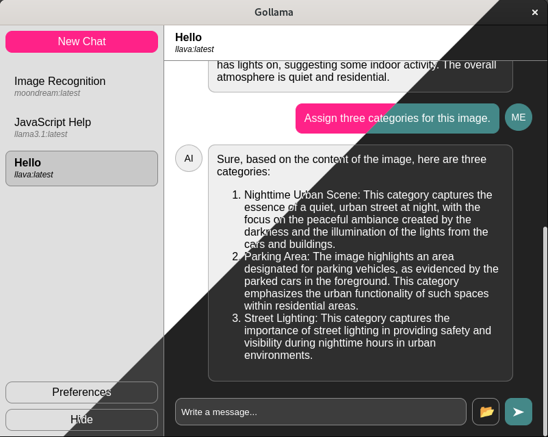

# Gollama

A GUI front-end for [Ollama](https://ollama.com) made with
[Electron](https://www.electronjs.org).

## Using the Application

When creating a new chat you can choose from a list of local models. Make sure
you have at least one local model. For example pull `gemma2:2b` model with

```
ollama pull gemma2:2b
```

## Building the Application

Make sure you have `nodejs`, `npm` and `ollama` installed.

Clone the project with `git` and inside the repository run the following.

```
npm install
npm run make
```

The `make` script will output distributables in `./out/make/` directory.

## Installing Distributables

On Windows run the setup `.exe` with

```cmd
"out\make\squirrel.windows\x64\Gollama-0.2.1 Setup.exe"
```

On Fedora install the `.rpm` package with

```bash
sudo rpm -i out/make/rpm/x64/Gollama-0.2.1-1.x86_64.rpm
```

On Debian install the `.deb` package with

```bash
sudo dpkg -i out/make/deb/x64/gollama_0.2.1_amd64.deb
```

> Note: architecture and version may be different.
